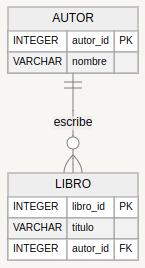

##ejemplo





```  json
{
 "autores": [
   {
     "autor_id": 1,
     "nombre": "Gabriel García Márquez",
     "libros": [
       {
         "libro_id": 1,
         "titulo": "Cien años de soledad"
       },
       {
         "libro_id": 2,
         "titulo": "El amor en los tiempos del cólera"
       }
     ]
   },
   {
     "autor_id": 2,
     "nombre": "Jorge Luis Borges",
     "libros": [
       {
         "libro_id": 3,
         "titulo": "Ficciones"
       },
       {
         "libro_id": 4,
         "titulo": "El Aleph"
       }
     ]
   }
 ]
}


```
